# Milestone 1 – Platform Foundation

> **Milestone Objective:** Establish the foundational infrastructure for the Enterprise Internal Developer Platform (IDP) by implementing a GitOps-driven Kubernetes platform capable of consistently deploying and managing applications.

---

| Project | Enterprise Internal Developer Platform |
|----------|----------------------------------------|
| Milestone | 1 – Platform Foundation |
| Status | ✅ Completed |
| Author | Geoffery Joshua |
| Platform | Kubernetes (Kind) |
| GitOps | Argo CD |
| Package Manager | Helm |
| Target Environment | Development Cluster |
| Documentation Version | 1.0 |

---

# Table of Contents

1. Executive Summary
2. Background
3. Engineering Goals
4. Scope
5. Architecture Principles
6. Platform Overview
7. High-Level Architecture
8. Technology Stack
9. Repository Structure
10. Implementation
11. Validation
12. Design Review
13. Engineering Decisions
14. Engineering Challenges
15. Lessons Learned
16. References
17. Milestone Summary
18. Project Progress
19. Next Milestone

# Executive Summary

Every platform needs a solid foundation before new capabilities can be added. This milestone focused on building that foundation.

The goal was not simply to deploy an application to Kubernetes, but to create a platform that could be managed consistently, scaled over time, and serve as the base for future capabilities such as continuous delivery, observability, security, and multi-cluster management.

To achieve this, I built two Kubernetes clusters using Kind. One cluster acts as the management cluster (Hub Cluster), hosting Argo CD and other platform services. The second cluster is dedicated to running applications in the development environment.

Instead of deploying workloads manually, I adopted a GitOps workflow using Argo CD. Every change to the platform is made through Git, allowing Kubernetes to automatically reconcile the live environment with the desired configuration stored in the repository. This approach improves consistency, reduces manual intervention, and provides a clear history of every infrastructure and application change.

By the end of this milestone, the platform was capable of automatically deploying applications from Git into the development cluster, providing a reliable foundation for the remaining milestones in this project.

# Background

Modern software teams rarely manage Kubernetes clusters manually. As the number of applications, environments, and engineers increases, manual deployments quickly become difficult to maintain. Configuration drift, inconsistent deployments, and undocumented changes can make even simple updates risky.

The purpose of this project is to build an Enterprise Internal Developer Platform (IDP) that addresses these challenges by automating how applications are deployed and managed.

Rather than treating Kubernetes as the final goal, this project uses Kubernetes as the platform on which additional engineering capabilities will be built. Each milestone introduces another layer of functionality, gradually transforming a basic Kubernetes environment into a production-inspired Internal Developer Platform.

This first milestone focuses on establishing that foundation by creating the Kubernetes clusters, implementing GitOps with Argo CD, and validating the deployment workflow before introducing more advanced platform capabilities.

# Engineering Goals

The primary objective of this milestone was to establish a reliable and scalable platform foundation capable of supporting future platform capabilities without requiring significant architectural changes.

By the completion of this milestone, the platform should be able to:

- Deploy applications using a GitOps workflow.
- Separate platform management from application workloads.
- Package applications using Helm.
- Maintain Git as the single source of truth.
- Support future observability, security, and multi-cluster capabilities.
- Provide a repeatable deployment process for additional services.

# Scope

This milestone focuses on building the core platform components required before introducing advanced capabilities.

The work completed in this milestone includes:

- Creating the Hub and Development Kubernetes clusters.
- Installing Argo CD.
- Registering the Development Cluster with Argo CD.
- Organising the repository to support GitOps workflows.
- Creating a Helm chart for the Payments API.
- Deploying the application through Argo CD.
- Configuring Kubernetes Services and Ingress.
- Verifying successful deployment and application health.

The following capabilities are intentionally left for later milestones:

- Continuous Integration (CI)
- Monitoring and alerting
- Centralised logging
- Security and policy enforcement
- Multi-cluster deployments
- Internal Developer Platform features

# Architecture Principles

## Git as the Single Source of Truth

Git stores the desired state of the platform. Every infrastructure and application change begins as a commit, allowing Argo CD to keep the Kubernetes environment synchronised with version-controlled configuration.

---

## Separation of Responsibilities

Platform management services are isolated from application workloads. This separation improves maintainability and makes it easier to expand the platform as new environments are introduced.

---

## Declarative Infrastructure

Infrastructure is defined using Kubernetes manifests and Helm charts instead of manual configuration. This ensures that deployments remain repeatable and consistent.

---

## Automation First

Routine operational tasks should be automated wherever possible. GitOps reduces manual deployment effort and helps eliminate configuration drift.

---

## Build for Growth

Although this milestone establishes the platform foundation, the architecture has been designed to support future capabilities such as observability, security, logging, and multi-cluster deployments.

# Platform Overview

The Enterprise Internal Developer Platform (IDP) is built around a Hub-and-Spoke architecture that separates platform management from application workloads.

The Hub Cluster hosts Argo CD and other shared platform services, while the Development Cluster is dedicated to running application workloads. Git acts as the operational source of truth, with Argo CD continuously reconciling the desired state stored in the repository against the live Kubernetes environment.

This architecture provides a clear separation of responsibilities, simplifies platform management, and establishes a scalable foundation that can support additional environments and platform services in future milestones.

---
# High-Level Architecture
## Architecture Diagram

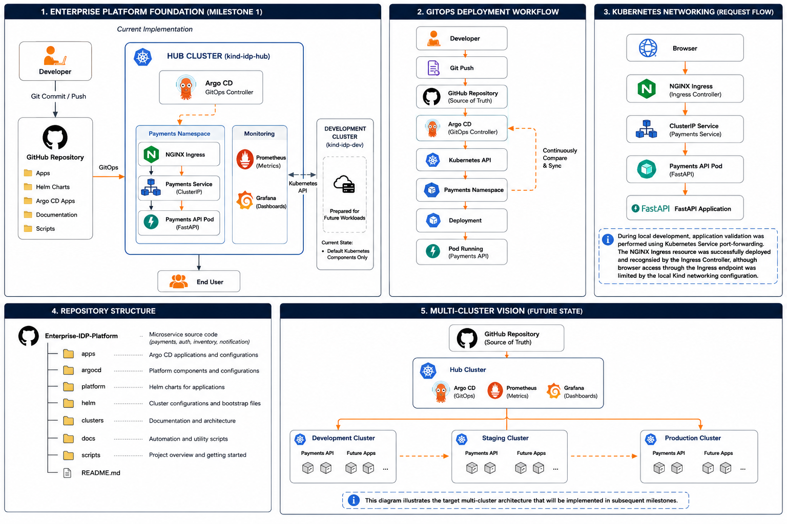

The diagram illustrates the relationship between the platform management layer and the application workload layer.

All configuration changes originate from Git, are reconciled by Argo CD running within the Hub Cluster, and are deployed automatically into the Development Cluster. This deployment model establishes Git as the operational source of truth and removes the need for manual Kubernetes deployments.

> **Figure 1.1 – Platform Foundation Architecture**
---

## Architecture Overview

The platform consists of five primary components that work together to automate application deployment.

### Developer Workstation

All platform changes begin on the developer workstation. Infrastructure, Kubernetes manifests, Helm charts, and application code are maintained within the Git repository. Every change follows the GitOps workflow by being committed to version control before reaching the Kubernetes clusters.

### Git Repository

The Git repository stores both platform configuration and application definitions. It contains the Helm charts, Argo CD Application manifests, Kubernetes resources, and supporting documentation that define the desired state of the platform.

Because Git is treated as the source of truth, manual configuration changes inside Kubernetes are avoided wherever possible.

### Hub Cluster

The Hub Cluster acts as the management plane for the platform.

Its primary responsibility during this milestone is to host Argo CD, which continuously compares the desired state stored in Git with the actual state of the managed Kubernetes clusters.

Future platform services such as monitoring, security, and platform automation will also be introduced through this cluster in later milestones.

### Development Cluster

The Development Cluster hosts the application workloads.

For this milestone, it runs the Payments API deployed through Helm and managed entirely by Argo CD.

Separating application workloads from the management cluster makes the platform easier to scale and more closely reflects enterprise Kubernetes environments.

### Payments API

The Payments API represents the first workload deployed through the platform.

The application is packaged as a Helm chart and deployed automatically through Argo CD. Kubernetes Services and Ingress resources expose the application while readiness and liveness probes help ensure that only healthy workloads receive traffic.

---
# Technology Stack

The Enterprise Internal Developer Platform is built using a collection of open-source technologies that work together to provide a scalable, automated, and production-inspired platform. Each tool was selected to solve a specific problem within the overall architecture rather than simply to demonstrate familiarity with different technologies.

| **Technology** | **Role** | **Why Chosen** | **Used In** |
|---------------|----------|----------------|-------------|
| **Kubernetes (Kind)** | Container Orchestration | Lightweight multi-cluster development | Hub & Development Clusters |
| **Argo CD** | GitOps Controller | Continuous reconciliation | Hub Cluster |
| **Helm** | Package Manager | Reusable deployments | Payments API |
| **GitHub** | Source Control | Single source of truth | Entire Platform |
| **Docker** | Container Runtime | Portable container images | Applications |
| **FastAPI** | Sample Application | Validate deployment workflow | Payments API |
| **NGINX Ingress** | Traffic Routing | External application access | Development Cluster |
| **YAML** | Declarative Configuration | Infrastructure as Code | Kubernetes Resources |

# Repository Structure

The repository is organised to separate platform infrastructure, application code, deployment configuration, and documentation into clearly defined directories. This structure makes the platform easier to understand, maintain, and extend as new capabilities are introduced.

Rather than keeping all Kubernetes manifests and application code together, related resources are grouped by responsibility. This mirrors how many platform engineering teams organise large repositories and allows each part of the platform to evolve independently.

The high-level repository structure is shown below.

```text
Enterprise-IDP-Platform/
│
├── apps/
├── argocd/
├── clusters/
├── demo/
├── docs/
├── helm/
├── platform/
├── scripts/
└── README.md
```

## Directory Overview

### `apps/`

The `apps` directory contains the source code for the applications deployed by the platform. Each application is maintained independently, making it easy to develop, containerise, and deploy without affecting other services.

During this milestone, the **Payments API** is used as the reference application to validate the GitOps deployment workflow.

---

### `argocd/`

This directory contains the Argo CD Application manifests that define which workloads Argo CD should manage.

These manifests connect the Git repository to the Kubernetes clusters and form the core of the GitOps workflow.

---

### `clusters/`

The `clusters` directory stores Kubernetes cluster-specific configuration.

Each environment has its own configuration, making it possible to manage multiple Kubernetes clusters using a consistent repository structure.

Examples include:

- Hub Cluster
- Development Cluster
- Staging Cluster
- Production Cluster

---

### `helm/`

Applications are packaged using Helm.

Each Helm chart contains the Kubernetes manifests required to deploy an application, along with configurable values for different environments.

Using Helm reduces duplication and makes application deployments easier to manage as the platform grows.

---

### `platform/`

The `platform` directory contains reusable platform components that are shared across environments.

Examples include:

- Argo CD
- Monitoring
- Logging
- Security
- Ingress

Keeping these components separate from application code allows the platform itself to evolve independently.

---

### `docs/`

All technical documentation is maintained under the `docs` directory.

Documentation is organised into milestones, with each milestone documenting a major platform capability introduced during the project.

Supporting materials such as architecture diagrams, runbooks, troubleshooting guides, and Architecture Decision Records (ADRs) are also maintained here.

---

### `demo/`

The demo directory contains resources used when demonstrating the platform, including presentation material, screenshots, and supporting assets.

---

### `scripts/`

Automation scripts are stored separately from platform configuration.

These scripts simplify repetitive operational tasks such as cluster bootstrapping, environment preparation, and platform setup.

---

## Repository Design Philosophy

The repository is organised around a simple principle:
 **Separate application code, platform infrastructure, deployment configuration, and documentation.**

This separation keeps the repository maintainable as the platform expands and makes it easier for engineers to locate the resources they need without navigating unrelated files.

It also reflects the structure commonly found in enterprise platform engineering projects, where infrastructure and applications are managed independently but remain connected through GitOps.


# Platform Implementation

This milestone focused on building the foundational platform that supports the rest of the Enterprise Internal Developer Platform (IDP).

The implementation was carried out in a logical sequence, beginning with the Kubernetes infrastructure before introducing GitOps, application packaging, and automated deployments. Each component was introduced only after the underlying platform was ready to support it.

The following sections describe the key implementation activities completed during this milestone.

---

## Phase 1 – Building the Kubernetes Environment

### Objective

Establish the foundational Kubernetes infrastructure required to support the Internal Developer Platform by creating dedicated clusters for platform management and application workloads.

### Technical Implementation

Two Kubernetes clusters were created using **Kind (Kubernetes IN Docker)**.

The **Hub Cluster** was designated to host platform management services such as Argo CD, while the **Development Cluster** was reserved for application workloads.

This separation mirrors enterprise Kubernetes architectures by isolating platform services from the applications they manage.
<details>
<summary><strong>View Evidence</strong></summary>


**Figure 1.2 – Available Kubernetes clusters created for the platform.**

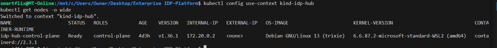

**Figure 1.3 – Hub Cluster node information showing the Kubernetes control plane is operational.**
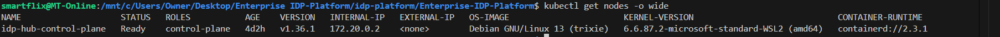
**Figure 1.4 – Development Cluster node information confirming the workload cluster is operational.**
</details>


### Outcome

A stable multi-cluster Kubernetes environment was successfully established. The platform now provides dedicated infrastructure for management and workload execution, creating a scalable foundation for future platform capabilities.

---

## Phase 2 – Establishing the GitOps Control Plane

### Objective

Introduce GitOps as the primary deployment model to automate application delivery and ensure that Kubernetes clusters continuously reflect the desired configuration stored in Git.

### Technical Implementation

Argo CD was installed into the Hub Cluster and configured as the platform's GitOps controller.

The Git repository was connected to Argo CD, enabling continuous monitoring of infrastructure and application configuration stored in version control.

Rather than deploying applications manually, Argo CD continuously reconciles the live Kubernetes environment with the desired state defined in Git.

<details>
<summary><strong>View Evidence</strong></summary>

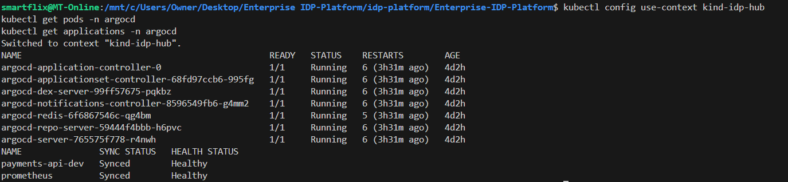

**Figure 2.1 – Argo CD components successfully deployed within the Hub Cluster.**

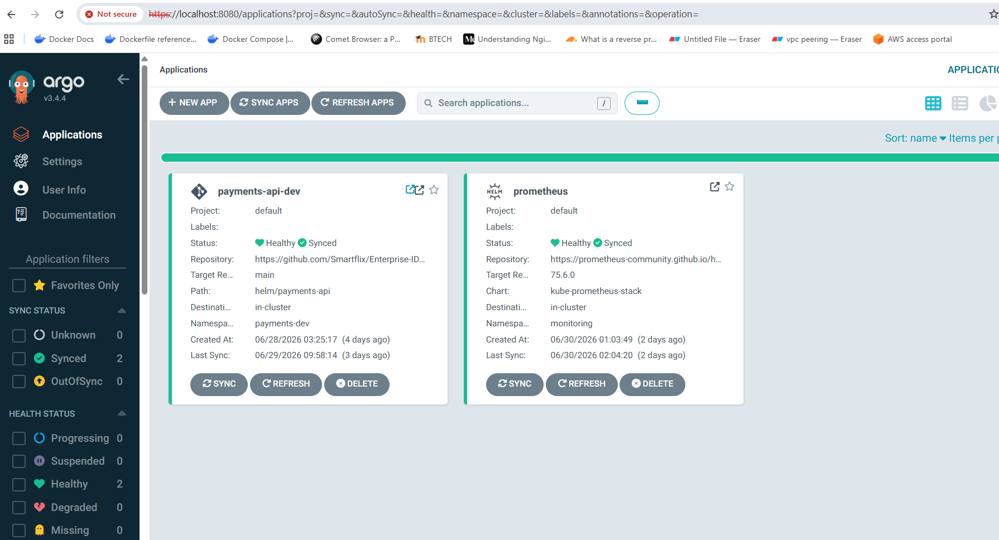

**Figure 2.2 – Argo CD dashboard showing the platform applications managed through GitOps.**
</details>


### Outcome

GitOps was successfully established as the platform's deployment strategy.

Infrastructure and application deployments can now be managed declaratively through Git, allowing Argo CD to automatically reconcile the live Kubernetes environment with the desired state stored in the repository.

This significantly reduces manual deployment effort while improving consistency, traceability, and operational reliability.

---


## Phase 3 – Registering the Development Cluster

### Objective

Enable the Hub Cluster to centrally manage application deployments to the Development Cluster through Argo CD.

### Technical Implementation

The Development Cluster was registered with Argo CD as a managed Kubernetes cluster.

This configuration allows the Hub Cluster to deploy, monitor, and reconcile workloads remotely while maintaining a clear separation between platform management and application execution.

<details>
<summary><strong>View Evidence</strong></summary>


**Figure 3.1 – Development Cluster successfully registered within Argo CD.**
</details>


### Outcome

The Development Cluster became fully managed by the GitOps control plane, establishing a centralised deployment architecture capable of supporting future multi-cluster expansion.

---

## Phase 4 – Organising the Repository

### Objective

Create a repository structure that separates application code, platform configuration, deployment manifests, and documentation to improve maintainability and scalability.

### Technical Implementation

The repository was organised into dedicated directories for applications, Helm charts, Argo CD configurations, Kubernetes cluster definitions, shared platform services, automation scripts, and technical documentation.

This modular structure aligns with GitOps best practices and simplifies long-term maintenance as the platform grows.

<details>
<summary><strong>View Evidence</strong></summary>

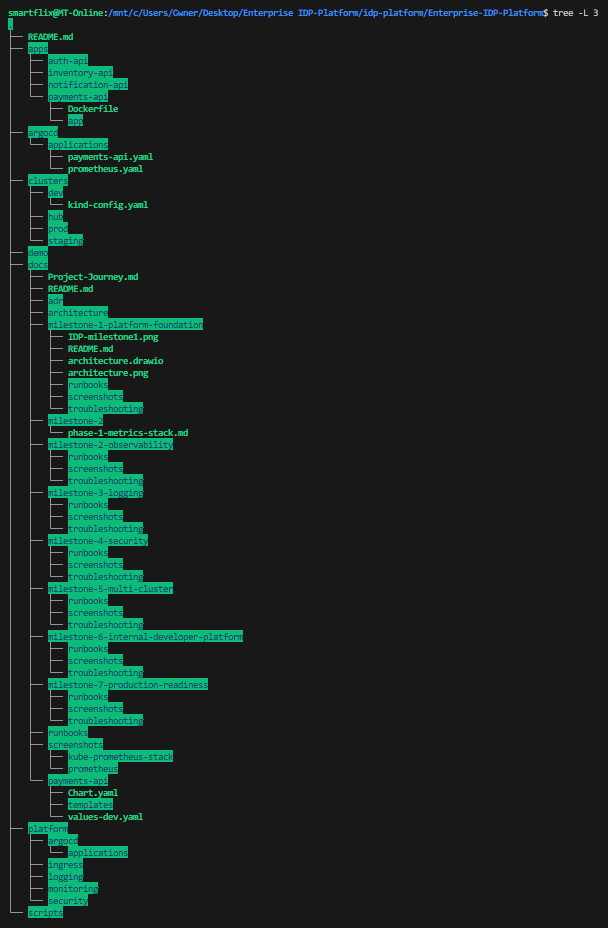

**Figure 4.1 – Repository structure used throughout the Enterprise Internal Developer Platform.**
</details>


Key directories include:

- `apps/` – application source code
- `helm/` – reusable Helm charts
- `argocd/` – Argo CD Application definitions
- `platform/` – shared platform services
- `clusters/` – cluster configuration
- `docs/` – technical documentation

This structure supports both GitOps workflows and long-term project growth.
### Outcome

A well-structured repository was established, making the platform easier to navigate, maintain, and extend as additional services and environments are introduced.


---

## Phase 5 – Packaging the Payments API

### Objective

Standardise application deployment by packaging the Payments API into a reusable and configurable Helm chart.

### Technical Implementation

The Payments API was containerised and packaged using Helm.

Deployment templates, Kubernetes Services, Ingress resources, and environment-specific configuration were organised within the Helm chart, allowing deployments to be customised through values files instead of modifying Kubernetes manifests directly.

The Helm chart includes:

- Deployment
- Service
- Ingress
- Environment-specific values

<details>
<summary><strong>View Evidence</strong></summary>

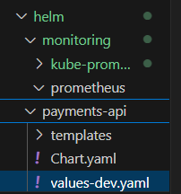

**Figure 5.1 – Helm chart structure used to package the Payments API.**

</details>


### Outcome

The Payments API became fully deployable using Helm, providing a reusable deployment mechanism that can easily be extended to additional environments and future microservices.


---
## Phase 6 – Deploying Through GitOps

### Objective

Validate the complete GitOps workflow by deploying the Payments API automatically from the Git repository into the Development Cluster.

### Technical Implementation

An Argo CD Application resource was created to monitor the Git repository.

Whenever changes were committed, Argo CD automatically detected the updates, compared the desired platform state with the running Kubernetes environment, and reconciled any differences by deploying the latest application configuration.

The deployment workflow followed these steps:

1. A developer commits changes to Git.
2. Changes are pushed to the Git repository.
3. Argo CD detects the update.
4. The desired state is compared with the live cluster.
5. Kubernetes resources are reconciled automatically.
6. The application is deployed to the Development Cluster.

<details>
<summary><strong>View Evidence</strong></summary>

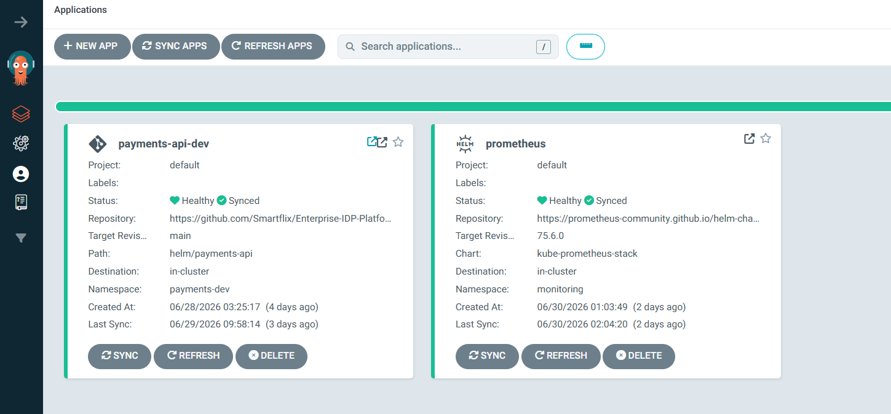

**Figure 6.1 – Payments API successfully deployed through GitOps with a Healthy and Synced status.**

---

#### Kubernetes Resource Tree

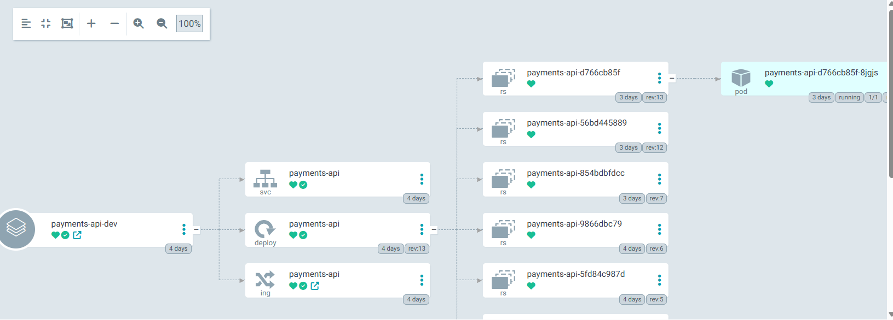

**Figure 6.2 – Kubernetes resources created and managed automatically by Argo CD.**
</details>


### Outcome

The platform successfully demonstrated a fully automated GitOps deployment workflow. Application deployments became repeatable, version-controlled, and independent of manual Kubernetes operations.


---


## Phase 7 – Exposing the Application

### Objective

Provide controlled external access to the Payments API while maintaining Kubernetes networking best practices.

### Technical Implementation

A Kubernetes Service was created to expose the application internally, while an NGINX Ingress resource was configured to route external traffic to the appropriate backend service.

This separates internal service discovery from external client access and establishes a flexible networking model that can support future enhancements such as TLS termination and load balancing.

<details>
<summary><strong>View Evidence</strong></summary>
The Payments API was successfully validated through Kubernetes Service port-forwarding.

The NGINX Ingress resource was configured and recognised by the Ingress Controller. Browser validation through the Ingress endpoint was limited by the local Kind networking configuration used during development.

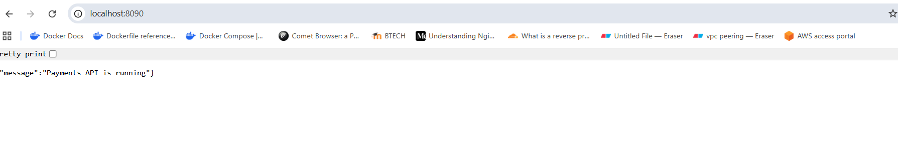

**Figure 7.1 – Payments API successfully accessed locally during platform validation.**
### Outcome
</details>


The Payments API became accessible through the configured Ingress endpoint, validating both the platform's networking configuration and its ability to expose workloads securely.

---

## Phase 8 – Platform Validation

### Objective

Verify that all platform components were functioning correctly and that the complete GitOps deployment workflow operated as designed.

### Technical Implementation

Validation activities included:

- Verifying the health of both Kubernetes clusters.
- Confirming successful communication between Argo CD and the Development Cluster.
- Validating the Helm deployment.
- Confirming Kubernetes Services and Ingress resources were operational.
- Ensuring the Payments API reached a **Healthy** and **Synced** state within Argo CD.
- Confirming successful application access through the configured Ingress endpoint.

<details>
<summary><strong>View Evidence</strong></summary>
Platform validation confirmed that Kubernetes resources were successfully created and operating as expected.

#### Platform Workloads

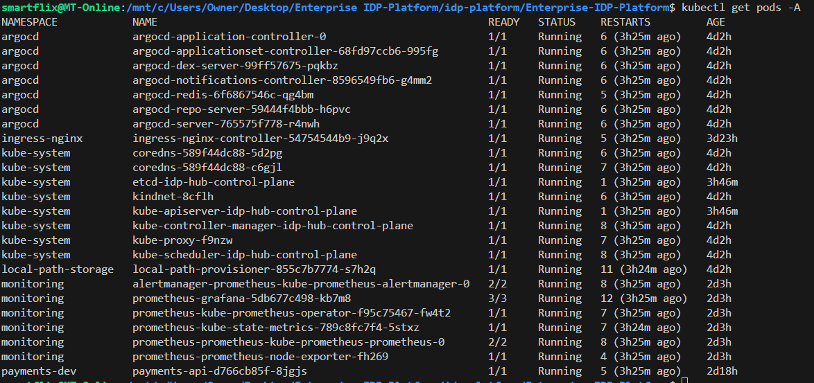

**Figure 8.1 – Kubernetes workloads running across the platform.**

---

#### Platform Services

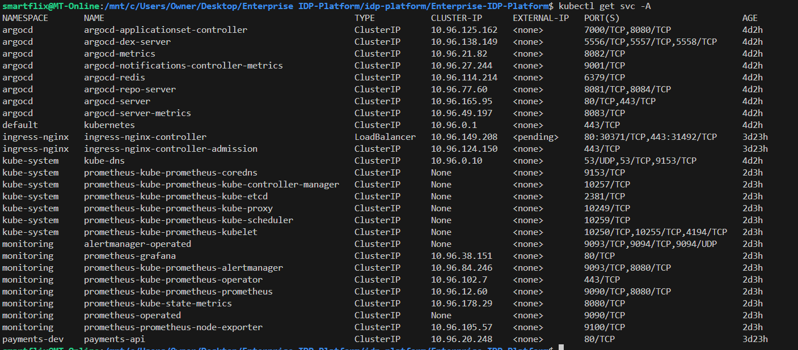

**Figure 8.2 – Kubernetes Services exposing platform components.**

---
#### Platform Ingress


**Figure 8.3 – Kubernetes Ingress resources configured for external application routing.**
</details>


### Outcome

All validation checks were completed successfully.

The Hub Cluster, Development Cluster, GitOps workflow, Helm deployment, Kubernetes networking, and application deployment all functioned together as expected.

This confirmed that the Enterprise Internal Developer Platform had established a stable and scalable foundation capable of supporting future milestones, including observability, logging, security, and multi-cluster platform management.

# Validation

Once the platform components had been deployed, a series of validation checks were carried out to confirm that the environment was operating as expected.

The objective was not only to verify that the application was running, but also to confirm that the GitOps workflow, Kubernetes infrastructure, and networking components were functioning together as a complete platform.

## Validation Checklist


  Component               Status
  ---------------------- --------
  Hub Cluster               ✅
  Development Cluster       ✅
  Argo CD                   ✅
  Cluster Registration      ✅
  GitOps Workflow           ✅
  Helm Deployment           ✅
  Service                   ✅
  Ingress                   ✅
  Application Health        ✅

## Acceptance Criteria

The milestone was considered complete once the following conditions had been met.

- Hub Cluster operational
- Development Cluster operational
- Argo CD installed successfully
- Development Cluster registered
- GitOps workflow operational
- Payments API Healthy
- Payments API Synced
- Application accessible through Ingress
---

## Verification Approach

## Evidence

Evidence supporting this milestone will be captured after the completion of Milestone 1.

The final documentation will include:

- Hub Cluster
- Development Cluster
- Argo CD Dashboard
- GitOps Synchronisation
- Payments API

Validation was carried out by confirming that the platform behaved as expected under normal operating conditions.

The following evidence was used to verify the implementation:

- Kubernetes clusters were running and reachable.
- Argo CD successfully connected to the Development Cluster.
- The Payments API was deployed through GitOps.
- Kubernetes resources reached their desired state.
- Application health checks completed successfully.
- External traffic reached the application through the configured Ingress.

Screenshots demonstrating the completed implementation will be included after the milestone documentation has been completed.

---

## Outcome

The successful completion of these validation checks confirmed that the platform foundation was operating correctly.

At this point, the Enterprise IDP Platform was capable of managing Kubernetes deployments using GitOps, providing a stable base for introducing monitoring, logging, security, and additional environments in later milestones.

# Design Review

At the conclusion of Milestone 1, the platform successfully achieved its primary design objectives.

The Hub-and-Spoke architecture provides a clear separation between platform management and application workloads. GitOps has been established as the operational deployment model, while Helm provides a standardised approach to packaging Kubernetes applications.

Although the platform currently hosts a single application, the architecture has been intentionally designed to support future capabilities including observability, logging, security, and multi-cluster management without requiring significant restructuring.

This review confirms that the platform foundation is stable and ready for Milestone 2.

# Engineering Decisions

Every technical decision made during this milestone was guided by a simple objective: build a platform that could grow without requiring significant architectural changes.

Rather than optimising for the quickest implementation, the focus was on creating a maintainable platform that reflects engineering practices commonly found in enterprise environments.

The most significant decisions made during this milestone are summarised below.

---

## Why a Hub-and-Spoke Architecture?

Instead of deploying both platform services and application workloads into a single Kubernetes cluster, the platform was designed around a Hub-and-Spoke model.

The Hub Cluster hosts platform management services such as Argo CD, while the Development Cluster is dedicated to running application workloads.

This separation provides several advantages:

- Keeps management services isolated from application workloads.
- Simplifies future expansion to additional environments.
- Reduces operational complexity.
- Aligns with common enterprise Kubernetes deployments.

---

## Why GitOps?

Git was adopted as the single source of truth for the platform.

Rather than applying Kubernetes manifests manually, every infrastructure and application change is committed to Git. Argo CD continuously reconciles the running environment with the desired configuration stored in the repository.

This approach provides:

- Version-controlled deployments.
- Improved traceability.
- Reduced configuration drift.
- Repeatable deployment workflows.

---

## Why Helm?

As the platform grows, maintaining individual Kubernetes manifests quickly becomes difficult.

Helm provides a consistent way to package Kubernetes resources while allowing environment-specific configuration through values files.

Using Helm also simplifies upgrades, configuration management, and future application deployments.

---

## Why Kind?

Although managed Kubernetes services are commonly used in production, Kind provides a lightweight environment for developing and validating platform capabilities locally.

Using Kind made it possible to:

- Build multiple Kubernetes clusters quickly.
- Recreate environments when required.
- Develop the platform without cloud infrastructure costs.
- Closely mirror production Kubernetes behaviour.

---

## Why Separate Platform and Application Code?

Platform components, application source code, deployment manifests, and documentation are maintained in separate directories.

This keeps responsibilities clearly defined and makes the repository easier to navigate as the project grows.

It also allows platform services to evolve independently from the applications they manage.


# Engineering Challenges

Building an Internal Developer Platform involves more than deploying Kubernetes resources. Several engineering challenges emerged while designing and implementing the platform, each requiring careful investigation before an appropriate solution could be applied.

The following challenges were the most significant during this milestone.

---


## Challenge 1 – Establishing a Reliable GitOps Workflow

### Challenge

One of the first challenges was selecting a deployment model that would remain maintainable as the platform expanded.

Although Kubernetes applications can be deployed manually using `kubectl`, this approach becomes increasingly difficult to manage across multiple environments and provides little protection against configuration drift.

### Investigation

Several deployment approaches were evaluated, including manual Kubernetes deployments and script-based automation.

While these methods could deploy applications successfully, they lacked continuous reconciliation, version-controlled infrastructure, and automated recovery when the live environment diverged from the desired configuration.

A GitOps workflow was identified as the most suitable approach because it establishes Git as the operational source of truth while continuously maintaining platform consistency.

### Solution

Argo CD was introduced as the GitOps controller for the platform.

The Git repository became the authoritative source for infrastructure and application configuration, allowing Argo CD to continuously compare the desired state stored in Git with the live Kubernetes environment and automatically reconcile any differences.

### Outcome

A fully automated GitOps deployment workflow was successfully established.

Infrastructure and application deployments became repeatable, traceable, and significantly easier to manage while reducing manual operational effort.

---

## Challenge 2 – Separating Platform Management from Application Workloads

### Challenge

A key architectural decision was determining whether platform services and application workloads should be hosted within a single Kubernetes cluster or separated across multiple clusters.

Hosting everything within one cluster would simplify the initial implementation but increase operational coupling as the platform expanded.

### Investigation

Both single-cluster and multi-cluster architectures were evaluated.

While a single cluster reduced initial complexity, it also introduced tighter coupling between platform services and application workloads, making future expansion and maintenance more difficult.

A Hub-and-Spoke architecture was selected because it provides a clear separation between platform management and application execution.

### Solution

Two independent Kubernetes clusters were created.

The Hub Cluster hosts Argo CD and other shared platform services, while the Development Cluster hosts application workloads.

This separation clearly defines operational responsibilities and supports future expansion into staging and production environments.

### Outcome

The platform now follows a scalable Hub-and-Spoke architecture that aligns with common enterprise Kubernetes deployment models and provides a strong foundation for future multi-cluster management.

---

## Challenge 3 – Standardising Application Deployment

### Challenge

Managing individual Kubernetes manifests for each application can quickly become difficult as the number of services and environments increases.

Duplicating deployment manifests across environments also increases maintenance effort and the likelihood of configuration inconsistencies.

### Investigation

Different deployment approaches were considered, including maintaining raw Kubernetes manifests and introducing a package management solution.

Helm was selected because it provides reusable deployment templates while allowing environment-specific configuration through values files.

This approach significantly reduces duplication and simplifies application lifecycle management.

### Solution

The Payments API was packaged as a Helm chart.

Deployment templates, Services, Ingress resources, and configuration values were organised into a reusable chart that supports consistent deployments across different environments.

### Outcome

Application deployment became standardised, reusable, and easier to maintain.

The Helm packaging approach also provides a consistent deployment model that can be reused for future platform services and microservices.

---

## Challenge 4 – Designing for Future Platform Growth

### Challenge

Although the immediate objective was to deploy a single application, the platform needed to support future capabilities such as observability, logging, security, and multi-cluster management without requiring significant architectural redesign.

### Investigation

The overall repository structure and platform architecture were designed with long-term scalability as a primary objective.

Rather than optimising only for the current milestone, the implementation focused on establishing modular components that could evolve independently as additional capabilities were introduced.

### Solution

The repository was organised into dedicated areas for application code, platform services, cluster configuration, deployment manifests, documentation, and automation.

Similarly, the Hub-and-Spoke architecture provides a flexible foundation capable of supporting additional Kubernetes clusters and platform services with minimal restructuring.

### Outcome

The Enterprise Internal Developer Platform now has an architecture that is modular, maintainable, and prepared for future expansion.

Subsequent milestones can introduce observability, centralised logging, security controls, and production-ready capabilities without requiring fundamental changes to the existing platform.

---

## Engineering Challenge Summary

Each challenge reinforced the importance of designing the platform with long-term maintainability in mind rather than simply achieving a successful deployment.

By investing in architectural decisions early—including GitOps, a Hub-and-Spoke deployment model, Helm packaging, and a modular repository structure—the platform is well positioned to support future capabilities while remaining manageable as it grows.

# Lessons Learned

Completing the first milestone provided valuable insights into platform engineering that extend beyond simply deploying applications to Kubernetes. While the technical objective was to establish a GitOps-driven platform, the experience reinforced several engineering principles that will influence the design of every subsequent milestone.

---

## A Strong Foundation Makes Future Growth Easier

One of the most important lessons from this milestone is that investing time in the platform architecture early significantly reduces complexity later.

Although creating separate clusters, organising the repository, and introducing GitOps required additional effort at the beginning, these decisions created a stable foundation that can support future capabilities such as monitoring, logging, security, and multi-cluster deployments without requiring major architectural changes.

---

## GitOps Changes the Way Infrastructure is Managed

Before implementing GitOps, it was easy to think of Kubernetes as a platform managed primarily through command-line tools.

This milestone demonstrated that Git should be treated as the operational interface for the platform. Instead of making changes directly to Kubernetes, every infrastructure and application update is defined in Git, reviewed, version controlled, and automatically applied by Argo CD.

This approach improves consistency, provides a complete audit trail, and reduces the risk of configuration drift between environments.

---

## Platform Engineering is More Than Kubernetes

Initially, the project focused on learning Kubernetes. As the platform evolved, it became clear that Kubernetes is only one part of a much larger ecosystem.

Building an Internal Developer Platform requires combining several technologies—including Git, Helm, containerisation, networking, automation, and documentation—into a single, cohesive platform that is easy to operate and maintain.

The platform itself becomes the product, while Kubernetes serves as the underlying runtime.

---

## Repository Organisation Matters

As more components were added to the project, maintaining a clear repository structure became increasingly important.

Separating applications, platform services, deployment configuration, and documentation has made the project easier to navigate and will simplify future maintenance as additional milestones are completed.

A well-organised repository is not just easier to understand—it also reflects disciplined engineering practices.

---

## Documentation Should Explain Decisions, Not Just Steps

Throughout this milestone, the focus shifted from documenting commands to documenting engineering decisions.

Rather than simply recording how the platform was built, the documentation explains why specific technologies were selected, why architectural decisions were made, and how those decisions support the long-term goals of the platform.

This approach makes the documentation more valuable for future maintenance and provides better context for anyone reviewing the project.

---

# Key Takeaways

- Build the architecture before adding platform capabilities.
- Treat Git as the operational source of truth.
- Separate platform management from application workloads.
- Design the repository to support long-term growth.
- Document the reasoning behind technical decisions, not just the implementation steps.

# Key Deliverables

By the completion of this milestone, the following platform capabilities had been successfully implemented:

- ✅ Hub Kubernetes Cluster
- ✅ Development Kubernetes Cluster
- ✅ GitOps Control Plane
- ✅ Argo CD Deployment
- ✅ Helm Packaging
- ✅ Payments API Deployment
- ✅ Kubernetes Services
- ✅ Kubernetes Ingress
- ✅ Automated GitOps Workflow

These deliverables establish the platform foundation required for introducing observability, logging, security, and additional Kubernetes environments in subsequent milestones.


# Milestone Summary

Milestone 1 established the foundation of the Enterprise Internal Developer Platform.

A Hub-and-Spoke Kubernetes architecture was implemented to separate platform management from application workloads. GitOps was introduced using Argo CD, allowing applications to be deployed and managed through declarative configuration stored in Git. The Payments API was packaged with Helm and successfully deployed to the Development Cluster, validating the end-to-end deployment workflow.

More importantly, this milestone established the architectural principles that will guide the remainder of the project. Decisions such as adopting GitOps, separating platform services from workloads, and organising the repository into clearly defined components provide a scalable foundation for future enhancements.

With the platform foundation in place, the project is now ready to introduce operational capabilities that improve visibility, reliability, and day-to-day management of the platform.

# References

The following official documentation and technical resources were referenced during the implementation of this milestone.

- Kubernetes Documentation
- Kind Documentation
- Argo CD Documentation
- Helm Documentation
- NGINX Ingress Controller Documentation
- FastAPI Documentation
- GitHub Documentation


# Project Progress

``` text
Enterprise Internal Developer Platform

███████□□□□□□□□□□□□□□□□□□□□□□□□□□□□ 14%

✅ Milestone 1 – Platform Foundation
⬜ Milestone 2 – Observability
⬜ Milestone 3 – Centralised Logging
⬜ Milestone 4 – Security
⬜ Milestone 5 – Multi-Cluster Platform
⬜ Milestone 6 – Internal Developer Platform
⬜ Milestone 7 – Production Readiness
```


# Next Milestone

With the platform foundation established, the next milestone focuses on introducing observability.

The goal is to provide visibility into the health and performance of the Kubernetes platform by deploying Prometheus and Grafana. These components will enable metrics collection, infrastructure monitoring, and operational dashboards that support proactive platform management.

By the end of Milestone 2, the platform will not only deploy applications through GitOps but will also provide real-time insight into the behaviour of both the infrastructure and the workloads running on it.