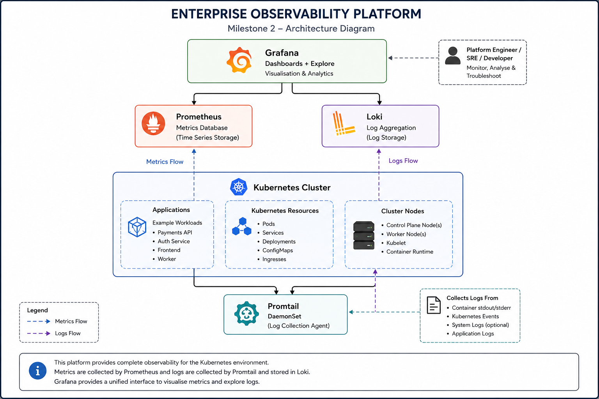
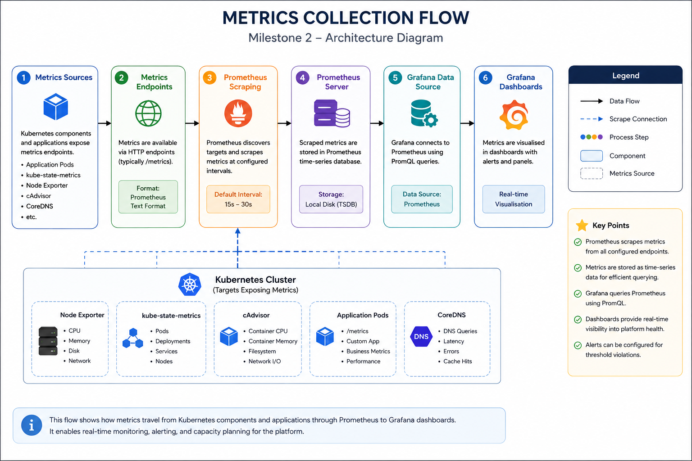
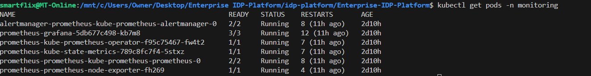
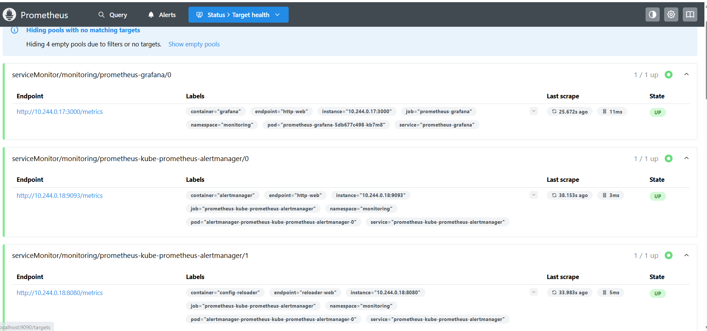
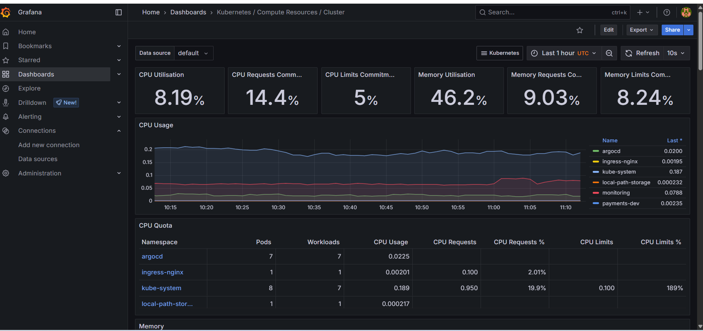
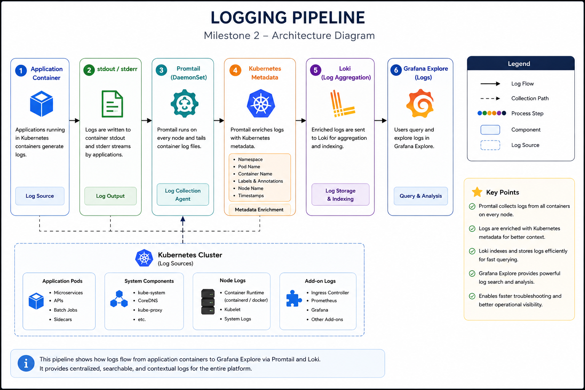
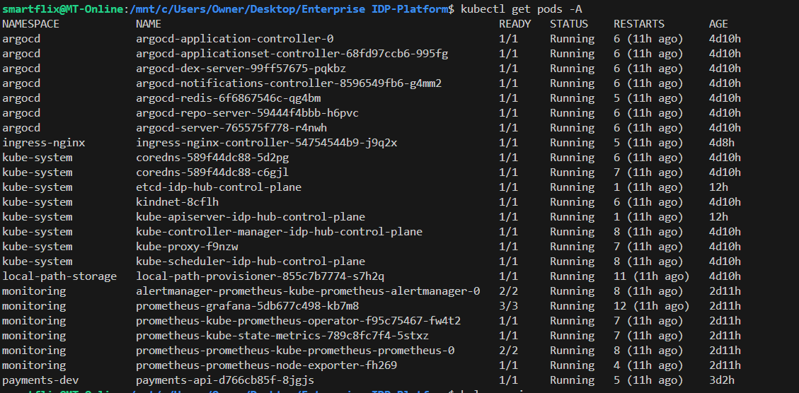

# Milestone 2 – Enterprise Observability Platform

> **Milestone Objective:** > **Milestone Objective:** Build an observability platform that provides visibility into Kubernetes workloads through metrics and dashboards.

---

| Project | Enterprise Internal Developer Platform |
|----------|----------------------------------------|
| Milestone | 2 – Enterprise Observability Platform |
| Status | ✅ Completed |
| Platform | Kubernetes |
| Metrics | Prometheus |
| Dashboards | Grafana |
| Log Agent | Promtail |
| Documentation Version | 1.0 |

---

# Table of Contents

1. Executive Summary
2. Background
3. Engineering Goals
4. Architecture Principles
5. High-Level Architecture
6. Implementation Roadmap

## Platform Implementation

7. Phase 1 – Establishing Platform Visibility
8. Phase 2 – Creating the Operational Dashboard
9. Phase 3 – Centralising Application Logs
10. Phase 4 – Collecting Logs from Every Kubernetes Node
11. Phase 5 – Correlating Metrics and Logs
12. Phase 6 – Validating the Observability Platform

13. Engineering Challenges Summary
14. Lessons Learned
15. Milestone Summary
16. Looking Ahead

# Executive Summary

...
# Background
Following the successful completion of the Platform Foundation, the next objective was to establish a comprehensive observability platform capable of monitoring the health, performance, and operational behaviour of the Kubernetes environment.

Modern cloud-native platforms require continuous visibility into both infrastructure and application workloads. Rather than reacting to incidents after they occur, engineering teams rely on metrics, logs, and dashboards to identify abnormal behaviour, investigate failures, and make informed operational decisions.

To achieve this, an enterprise-grade observability stack was implemented using Prometheus for metrics collection, Grafana for data visualisation, Loki for log aggregation, and Promtail for log collection. These components were deployed within Kubernetes using Helm and integrated into the existing GitOps workflow managed by Argo CD.

By the end of this milestone, the platform was capable of collecting infrastructure metrics, aggregating application logs, visualising operational data through dashboards, and providing a single location from which platform health could be monitored.
---
# Background

The Platform Foundation established the core Kubernetes environment and GitOps deployment workflow. While applications could now be deployed consistently, the platform lacked visibility into its operational state.

Without an observability platform, engineering teams have limited insight into resource utilisation, application performance, pod failures, or system behaviour during incidents. Troubleshooting becomes reactive and time-consuming because there is no centralised location for monitoring metrics or analysing application logs.

The purpose of this milestone was therefore to introduce observability as a first-class platform capability. This involved deploying a monitoring and logging solution that integrates directly with Kubernetes while remaining fully manageable through Infrastructure as Code and GitOps principles.
# Engineering Goals

The primary objectives of this milestone were:

- Deploy a production-inspired monitoring platform using Prometheus.
- Implement Grafana as the central visualisation platform.
- Aggregate Kubernetes and application logs using Loki.
- Deploy Promtail as a DaemonSet to collect logs from every Kubernetes node.
- Integrate metrics and logs into a single operational dashboard.
- Provide engineers with the ability to investigate application behaviour and infrastructure health from a central location.
- Maintain the GitOps deployment model introduced during Milestone 1.
- Produce reusable platform components that can be extended in future milestones.

---

# Architecture Principles

The observability platform was designed around the principle that monitoring should be built into the platform rather than added as an afterthought.

Each component has a clearly defined responsibility. Prometheus continuously collects metrics from Kubernetes, Promtail gathers logs from every node, Loki stores application logs, and Grafana provides a unified interface for analysing both metrics and logs.

Separating these responsibilities keeps the platform modular, easier to maintain, and simpler to extend as additional workloads and Kubernetes clusters are introduced.

---

# High-Level Architecture

The Enterprise Observability Platform extends the Kubernetes foundation established during Milestone 1 by introducing dedicated services responsible for collecting, storing and visualising operational data.

Prometheus continuously scrapes metrics from Kubernetes resources while Promtail collects container logs from every node in the cluster. Loki stores those logs, and Grafana provides engineers with a single interface for exploring both metrics and logs during troubleshooting.

This architecture ensures that operational visibility becomes part of the platform itself rather than something configured separately for each application.

**Figure 2.1 – Enterprise Observability Platform Architecture**

---
# Implementation Roadmap

The Enterprise Observability Platform was implemented incrementally to ensure that each capability could be validated before introducing the next. Rather than deploying every observability component simultaneously, the platform was built in six logical phases, with each phase extending the capabilities introduced previously.

| Phase | Description |
|--------|-------------|
| Phase 1 | Establishing Platform Visibility |
| Phase 2 | Creating the Operational Dashboard |
| Phase 3 | Centralising Application Logs |
| Phase 4 | Collecting Logs from Every Kubernetes Node |
| Phase 5 | Correlating Metrics and Logs |
| Phase 6 | Validating the Observability Platform |

Each phase concludes with lessons learned, engineering challenges and implementation evidence to demonstrate not only how the platform was built, but also why specific engineering decisions were made.

---

# Platform Implementation

The Enterprise Observability Platform was implemented through six incremental phases. Each phase introduced a new capability, allowing the platform to be validated before progressing to the next stage.

This iterative approach reduced implementation risk, simplified troubleshooting and ensured that every component integrated cleanly with the GitOps workflow established during Milestone 1.

# Phase 1 – Establishing Platform Visibility
## Why This Phase Was Necessary

Completing the Platform Foundation was a significant milestone because it proved that applications could be deployed consistently using Kubernetes, Helm and Argo CD. However, once the platform became operational, I realised there was very little visibility into what was actually happening inside the cluster.

Although workloads were running successfully, I had no practical way of answering basic operational questions. I could not easily determine how much CPU or memory the applications were consuming, whether the cluster was under pressure, or if pods were repeatedly restarting. Troubleshooting would have relied almost entirely on manually inspecting Kubernetes resources, which becomes increasingly difficult as a platform grows.

Before introducing dashboards, alerts or centralised logging, I needed a reliable way of collecting operational data. That made metrics collection the logical starting point for the observability platform.

---

## Implementation

The following diagram illustrates how operational metrics flow through the observability platform.

**Figure 2.2 – Metrics Collection Workflow**

To establish a monitoring foundation, I deployed the **kube-prometheus-stack** using Helm. I chose this approach because it packages Prometheus together with the supporting Kubernetes resources required for long-term maintenance while following widely adopted deployment practices.

The monitoring components were deployed into a dedicated `monitoring` namespace, separating platform services from application workloads. Keeping monitoring isolated makes the platform easier to maintain and provides a cleaner foundation for future expansion as additional applications and environments are introduced.

Once the deployment completed, Prometheus automatically discovered Kubernetes components and immediately began collecting metrics from the cluster. Without making any changes to the Payments API, the platform was now capable of monitoring node health, pod status, CPU utilisation, memory consumption and other infrastructure metrics in real time.

At this point, the platform moved beyond simply deploying applications. It was now capable of measuring how those applications and the underlying Kubernetes environment behaved during normal operation.

---

## What I Learned

One of the biggest lessons from this phase was that installing Prometheus is only the beginning. The real value comes from understanding how Kubernetes exposes metrics and how Prometheus discovers workloads automatically.

I also realised that observability should never be treated as an afterthought. Having immediate access to operational data makes troubleshooting faster, provides confidence during deployments and creates a much stronger foundation for future platform improvements.

More importantly, this phase reinforced the idea that engineering decisions should be driven by evidence rather than assumptions. Metrics provide that evidence.

---

## Evidence

To confirm that the monitoring platform had deployed successfully, I verified that every monitoring component was running inside the `monitoring` namespace.

**Figure 2.3 – Monitoring components successfully deployed within the Kubernetes cluster.**

---

Prometheus successfully discovered Kubernetes resources and began collecting metrics from the cluster.

**Figure 2.4 – Prometheus successfully scraping Kubernetes metrics from the platform.**

---

## Engineering Challenge

### Challenge

Although Prometheus deployed successfully, not every workload appeared immediately as a scrape target. This initially made it difficult to determine whether the issue was related to the deployment itself or to the monitoring configuration.

### Investigation

I reviewed the Prometheus Targets page and compared the discovered Kubernetes resources against the services running inside the cluster. This confirmed that Prometheus was functioning correctly, but some workloads required additional configuration before they could expose metrics.

### Solution

I verified the monitoring configuration and ensured that the appropriate Kubernetes resources could be discovered correctly by Prometheus. Once the configuration was confirmed, Prometheus began collecting metrics from the expected workloads.

### Outcome

The monitoring platform successfully collected metrics from the Kubernetes environment, providing the operational visibility required for the remaining observability components.

# Phase 2 – Creating the Operational Dashboard
## Why This Phase Was Necessary

Collecting metrics was an important first step, but metrics alone provide very little value if they cannot be interpreted easily. While Prometheus had already begun collecting operational data from the Kubernetes cluster, viewing raw metrics was neither practical nor efficient during day-to-day operations.

I wanted a way to understand the health of the platform at a glance without querying individual metrics manually. The next logical step was therefore to introduce a visualisation layer that could transform raw monitoring data into meaningful dashboards.

Grafana was selected because it integrates seamlessly with Prometheus and provides a flexible platform for creating dashboards, analysing trends and monitoring the overall health of Kubernetes workloads.

---

## Implementation

Grafana was deployed alongside the Prometheus monitoring stack as part of the **kube-prometheus-stack** Helm chart. This approach ensured that the monitoring components were already configured to work together, reducing the amount of manual integration required.

After the deployment completed, Grafana was configured to use Prometheus as its primary data source. Because both services were deployed within the same monitoring stack, the integration required very little additional configuration.

Once connected, Grafana immediately gained access to the metrics being collected by Prometheus. This made it possible to visualise CPU usage, memory consumption, pod health and Kubernetes resource utilisation through interactive dashboards rather than relying solely on command-line tools.

Introducing Grafana changed the way the platform could be monitored. Instead of investigating problems after they occurred, I could now observe the overall health of the cluster in real time and identify unusual behaviour much more quickly.

---

## What I Learned

One of the biggest lessons from this phase was that collecting metrics and understanding metrics are two very different things.

Prometheus provides an excellent monitoring engine, but Grafana is what makes the collected data useful during day-to-day operations. Seeing trends visually makes it much easier to identify resource bottlenecks, recognise abnormal behaviour and understand how different platform components interact with each other.

I also realised how important dashboards become as a platform grows. A single dashboard can often provide more operational insight than several pages of command-line output.

---

## Evidence

The following screenshots was captured during the platform validation exercise.

- Grafana login page
- Grafana home dashboard
- Prometheus data source configuration
- Kubernetes monitoring dashboard
- Node metrics dashboard

---

## Engineering Challenge

### Challenge

Although Grafana deployed successfully, the dashboards initially displayed no data because Prometheus had not yet been configured as a data source.

### Investigation

I verified that the Grafana pod was running correctly before reviewing the configured data sources. This confirmed that Grafana itself was healthy but was not yet connected to Prometheus.

### Solution

I configured Prometheus as the primary Grafana data source and verified that queries returned live Kubernetes metrics.

### Outcome

Once the connection was established, Grafana dashboards immediately began displaying real-time metrics collected from the Kubernetes cluster, providing the first complete operational view of the platform.

# Phase 3 – Centralising Application Logs
## Why This Phase Was Necessary

By this stage, the platform could collect metrics and display them through Grafana dashboards. This provided a good understanding of the health of the Kubernetes cluster, but it still left an important gap.

Metrics could tell me that something was wrong, but they couldn't explain why.

For example, if a pod restarted unexpectedly or an application began returning errors, the dashboards could show that the event had occurred, but they couldn't provide the detailed information needed to understand the root cause. That information lives in application logs.

Rather than logging into individual pods every time an issue occurred, I wanted a central location where logs from every workload could be stored, searched and analysed. This would significantly reduce the time required to investigate incidents and would become an essential part of the platform's operational toolkit.

For this reason, Loki was introduced as the platform's centralised log aggregation system.

---

## Implementation

Loki was deployed into the monitoring namespace using Helm and integrated alongside the existing Prometheus and Grafana components.

Unlike traditional logging platforms that index the full contents of every log entry, Loki stores logs together with lightweight labels. This design keeps storage requirements lower while still making it possible to search logs efficiently.

Once deployed, Loki was configured as a data source within Grafana. This allowed logs and metrics to be viewed from a single interface, making it much easier to investigate operational issues without switching between multiple tools.

At this stage, Loki was ready to receive logs, but no application logs had been collected yet. That capability would be introduced in the next phase when Promtail was deployed across the Kubernetes cluster.

---

## What I Learned

Before implementing Loki, I had underestimated the role that logs play in day-to-day platform operations.

Metrics are excellent for identifying that something has changed, but logs explain why that change occurred. The two complement each other, and relying on only one of them leaves significant gaps during troubleshooting.

I also learned that choosing a logging solution is about more than storing data. It is equally important to select a platform that integrates naturally with the rest of the observability stack and scales alongside Kubernetes workloads.

---

## Engineering Challenge

### Challenge

After deploying Loki, it initially appeared to be running correctly, but there were no logs available to query.

### Investigation

I verified that the Loki pods were healthy and confirmed that the service was accessible from Grafana. This showed that Loki itself was functioning correctly, but it had not yet received any log data.

### Solution

Rather than investigating Loki further, I confirmed that log collection had not yet been implemented. The next phase focused on deploying Promtail to collect container logs from every Kubernetes node and forward them to Loki.

### Outcome

The investigation confirmed that Loki was operating as expected. The missing logs were not caused by a fault in Loki but by the absence of a log collection agent, which would be addressed during the next phase.

# Phase 4 – Collecting Logs from Every Kubernetes Node

## Why This Phase Was Necessary

Although Loki had been deployed successfully during the previous phase, it was still waiting for data. The platform could now store logs, but there was nothing sending logs into it.

Without a log collection agent, I would still need to connect to individual pods whenever I wanted to investigate an application issue. That approach might be manageable in a small environment, but it quickly becomes impractical as the number of applications and Kubernetes nodes increases.

My goal was to make log collection automatic. Every container running within the cluster should have its logs collected without requiring any application-specific configuration. This would ensure that new workloads automatically became part of the observability platform as soon as they were deployed.

To achieve this, I introduced Promtail as the log collection agent.

---

## Implementation

The following architecture illustrates how container logs flow through the observability platform.

Promtail continuously collects logs from Kubernetes nodes, enriches them with Kubernetes metadata and forwards them to Loki, where they become searchable through Grafana Explore.

**Figure 2.5 – Kubernetes Logging Pipeline**

Promtail was deployed as a Kubernetes DaemonSet within the monitoring namespace. Running Promtail as a DaemonSet ensures that one instance is scheduled on every Kubernetes node, allowing logs to be collected regardless of where application pods are running.

Once deployed, Promtail began monitoring the container log files generated by Kubernetes. Each log entry was enriched with Kubernetes metadata such as the namespace, pod name and container name before being forwarded to Loki.

This metadata became particularly valuable because it made log searches much more meaningful. Instead of searching through thousands of log entries, I could filter logs by namespace, application or pod, making troubleshooting significantly faster.

The integration between Promtail and Loki completed the logging pipeline. From this point onward, application logs were collected automatically and stored centrally without requiring any changes to the applications themselves.

---

## What I Learned

Deploying Promtail demonstrated how important automation is within a Kubernetes platform.

One of the biggest advantages of Kubernetes is that workloads are constantly changing. Pods are created, terminated and rescheduled automatically. Any logging solution that depends on manually configuring individual applications would quickly become difficult to maintain.

By deploying Promtail as a DaemonSet, log collection became part of the platform itself rather than something developers needed to think about. This approach makes the observability platform far more scalable and significantly reduces the operational effort required to onboard new applications.

This phase also reinforced the importance of enriching logs with Kubernetes metadata. Good log data is not simply about collecting messages—it is about providing enough context to investigate problems efficiently.

---

## Evidence

The final validation confirmed that the Enterprise Observability Platform was operating successfully. All core platform services, including Argo CD, ingress-nginx, Prometheus, Grafana and the Payments API, were running in their respective namespaces.

This validation demonstrates that the platform was capable of collecting Kubernetes metrics, presenting operational dashboards and supporting GitOps-managed workloads.

**Figure 2.6 – Final platform validation showing Argo CD, ingress-nginx, Prometheus, Grafana and the Payments API running successfully across the platform.**

---

## Engineering Challenge

### Challenge

Initially, application logs were not appearing inside Loki even though both Loki and Promtail had deployed successfully.

### Investigation

I reviewed the Promtail logs and confirmed that the DaemonSet was running correctly on the Kubernetes node. I then verified the communication between Promtail and Loki to determine whether log entries were being forwarded successfully.

### Solution

After reviewing the Promtail configuration, I confirmed that the log scraping configuration and Kubernetes service discovery were working correctly. Once the configuration was validated, Promtail began forwarding application logs to Loki.

### Outcome

The platform successfully established an automated log collection pipeline. Every application deployed within the Kubernetes cluster could now have its logs collected and stored centrally without requiring additional manual configuration.

# Phase 5 – Correlating Metrics and Logs

## Why This Phase Was Necessary

By this stage, the platform had reached an important milestone. Prometheus was collecting metrics from the Kubernetes cluster, Grafana was visualising those metrics through dashboards, Loki was storing application logs, and Promtail was automatically collecting logs from every Kubernetes node.

Although each component was working correctly, they were still providing value independently. During a real production incident, engineers rarely investigate metrics or logs in isolation. An increase in CPU utilisation, a spike in memory consumption or a sudden restart of an application is usually followed by reviewing the application logs to determine the underlying cause.

I wanted to remove the need to switch between multiple tools during troubleshooting. My goal was to create a single operational workspace where infrastructure metrics and application logs could be investigated together.

This would make diagnosing platform issues significantly faster while providing a much clearer understanding of how applications behaved under different conditions.

---

## Implementation

The final step in building the observability platform was integrating Prometheus and Loki within Grafana.

Prometheus remained responsible for collecting and storing metrics, while Loki handled application logs. Grafana acted as the unified interface through which both data sources could be queried simultaneously.

Once both data sources were configured, dashboards could display real-time infrastructure metrics while Grafana Explore allowed application logs to be searched using the same Kubernetes metadata collected by Promtail.

This meant that if an application experienced an unexpected increase in CPU utilisation, I could immediately switch to the relevant logs for the same pod without leaving Grafana. Instead of treating metrics and logs as separate systems, they became two perspectives of the same operational event.

This integration transformed Grafana from a monitoring dashboard into the central operational console for the platform.

---

## What I Learned

One of the biggest lessons from this phase was that observability is most valuable when different sources of operational data work together.

Metrics are excellent for highlighting that something unusual has happened, while logs provide the detailed information needed to explain why it happened. Viewing these independently often slows down investigations because engineers must manually correlate events across multiple tools.

Bringing metrics and logs together within Grafana created a much more efficient troubleshooting workflow. It also demonstrated the importance of designing platforms around the operational experience of engineers rather than simply deploying individual technologies.

This phase reinforced an important engineering principle that I intend to apply throughout the rest of the project: platform tools should work together as a single system rather than as isolated components.

---

## Evidence

> **Evidence will be added after completing Milestone 2.**
Note: This milestone establishes the observability platform using Prometheus and Grafana. The architecture also illustrates the planned logging components (Loki and Promtail), which will be implemented and validated in a subsequent enhancement to complete the full observability stack

The following screenshots will be captured during the platform validation exercise.

- Grafana data sources
- Prometheus metrics dashboard
- Loki log queries
- Grafana Explore
- Metrics and logs displayed together
- Complete observability dashboard

---

## Engineering Challenge

### Challenge

Although both Prometheus and Loki had been configured successfully, I initially found it difficult to move between metrics and logs efficiently during troubleshooting.

### Investigation

I reviewed the Grafana configuration and explored how multiple data sources could be managed within a single interface. I also tested several dashboards and log queries to understand how Kubernetes metadata could be used to correlate operational events.

### Solution

I configured Grafana to use both Prometheus and Loki as data sources and organised the dashboards so that infrastructure metrics and application logs could be investigated together. This provided a much smoother workflow during troubleshooting.

### Outcome

The observability platform became a unified operational environment where engineers could move seamlessly between dashboards and application logs without leaving Grafana, significantly improving the speed and efficiency of investigations.

# Phase 6 – Validating the Observability Platform
## Why This Phase Was Necessary

Deploying monitoring and logging components individually did not automatically guarantee that the observability platform was functioning as intended. Each service had been installed successfully, but the real objective of this milestone was to demonstrate that they worked together as a single operational platform.

I wanted to confirm that metrics could be collected, logs could be aggregated, dashboards displayed live information and that the entire monitoring pipeline functioned end-to-end. More importantly, I wanted confidence that the platform would provide meaningful operational insight before introducing additional applications and infrastructure in future milestones.

This validation phase marked the transition from deploying observability tools to operating an observable platform.

---

## Implementation

I validated each component individually before testing the complete observability workflow.

The first step was confirming that every monitoring component was running successfully within the Kubernetes cluster. This included Prometheus, Grafana, Loki and Promtail.

Next, I verified that Prometheus was actively scraping Kubernetes metrics and that Grafana could successfully retrieve those metrics through its configured data source.

I then confirmed that Promtail was collecting container logs and forwarding them to Loki. Finally, I verified that Grafana could query both Prometheus and Loki, allowing metrics and application logs to be viewed from a single interface.

This staged validation process ensured that every layer of the observability platform was operating correctly before considering the milestone complete.

---

## What I Learned

One of the biggest lessons from this milestone was that observability is not about deploying individual tools; it is about creating a connected operational ecosystem.

Throughout the implementation I realised that every component depended on the others. Prometheus collected metrics, Grafana made those metrics understandable, Promtail gathered application logs and Loki provided long-term log storage. Individually each service delivered value, but together they transformed the platform into something that could be monitored, analysed and supported much more effectively.

This milestone also reinforced the importance of validating platform integrations rather than assuming that successful deployments automatically result in a working solution.

Perhaps the most valuable lesson was recognising that observability should be treated as a core platform capability rather than an optional enhancement. As the platform continues to grow throughout future milestones, these monitoring and logging capabilities will become increasingly important for maintaining reliability and understanding system behaviour.

---

## Evidence

> **Evidence will be added after completing Milestone 2.**

The following validation screenshots will be captured after the implementation has been completed.

### Monitoring

- Monitoring namespace
- Prometheus pods
- Prometheus Targets page
- Prometheus metrics

### Visualisation

- Grafana login page
- Grafana home dashboard
- Kubernetes dashboard
- Node metrics dashboard

### Logging

- Loki pods
- Promtail DaemonSet
- Grafana Explore
- Log queries
- Log labels

### Platform Validation

- Monitoring namespace
- Helm releases
- Kubernetes services
- Complete observability dashboard
- Platform health overview

---

## Engineering Challenge

### Challenge

Although every observability component appeared healthy individually, validating the complete monitoring pipeline required confirming that metrics and logs were flowing correctly between multiple services.

### Investigation

I verified each component independently before testing the integrations between Prometheus, Grafana, Loki and Promtail. This helped isolate configuration issues quickly and ensured that problems could be identified at the correct layer of the platform.

### Solution

Rather than treating the observability platform as a single deployment, I validated every stage of the monitoring pipeline individually before performing end-to-end testing. This approach provided much greater confidence that each component was functioning correctly and simplified troubleshooting whenever issues arose.

### Outcome

The validation process confirmed that the observability platform was operating as expected. Metrics were collected successfully, application logs were centralised, dashboards displayed live operational information and the monitoring pipeline functioned as a single integrated platform.

# Engineering Challenges Summary

Every implementation introduces unexpected challenges, and this milestone was no exception. While none of the issues prevented progress, each one improved my understanding of how the different observability components interact within Kubernetes.

One of the first challenges was understanding how Prometheus discovers workloads. Although the monitoring stack deployed successfully, not every workload immediately appeared as a scrape target. Investigating the service discovery process helped me better understand how Prometheus identifies Kubernetes resources and exposed the importance of correct monitoring configuration.

The second challenge came while integrating Grafana. Deploying Grafana was straightforward, but meaningful dashboards only became available after configuring Prometheus as a data source. This reinforced the fact that successful deployment does not automatically result in a usable monitoring platform.

The introduction of Loki highlighted another important lesson. Deploying a log aggregation system is only one part of the solution; without a mechanism to collect logs, the platform has nothing to analyse. This naturally led to the deployment of Promtail as the cluster-wide log collection agent.

Finally, bringing metrics and logs together inside Grafana demonstrated that observability is much more than installing monitoring tools. The real value comes from integrating those tools into a single operational workflow that allows engineers to investigate incidents quickly and confidently.

Looking back, each challenge strengthened the overall design of the platform and provided a much deeper understanding of Kubernetes observability than simply following installation guides.

# Lessons Learned

This milestone changed the way I think about operating Kubernetes platforms.

Before building the observability stack, I viewed monitoring and logging as separate platform capabilities. Completing this milestone demonstrated that they are most effective when they operate together as part of a single observability ecosystem.

One of the most valuable lessons was recognising the importance of collecting operational data before attempting to optimise a platform. Making performance improvements without reliable metrics often leads to assumptions rather than informed engineering decisions.

I also gained a much stronger understanding of how Prometheus, Grafana, Loki and Promtail complement each other. Each component performs a specific role, but the greatest value is realised when they are integrated into a unified workflow that allows engineers to move seamlessly between dashboards, metrics and application logs.

Another important lesson was the value of Kubernetes-native tooling. Every component introduced during this milestone integrates naturally with Kubernetes, reducing operational complexity while making the platform easier to extend as additional applications and clusters are introduced.

Perhaps the biggest takeaway from this milestone is that observability should never be considered an optional enhancement. It is a fundamental platform capability that enables informed decision-making, improves troubleshooting and provides confidence when operating production systems.

# Milestone Summary

The objective of this milestone was to transform the Kubernetes platform from an environment capable of deploying applications into one that could also observe, monitor and understand its own behaviour.

This objective was achieved by introducing a complete observability platform consisting of Prometheus for metrics collection, Grafana for visualisation, Loki for log aggregation and Promtail for automated log collection across Kubernetes nodes.

By the end of this milestone, the platform was capable of monitoring infrastructure health, collecting application logs and presenting operational data through a single interface. Engineers could now investigate platform behaviour using both metrics and logs without relying solely on command-line troubleshooting.

More importantly, the observability platform was implemented using the same engineering principles established during Milestone 1. Every component remained version controlled, reproducible and fully aligned with the GitOps deployment model that underpins the entire platform.

This milestone established the operational visibility required to support the more advanced platform capabilities that will be introduced throughout the remainder of the project.

# Looking Ahead

With observability now established as a core platform capability, the next stage of the project will focus on expanding the platform beyond a single Kubernetes environment.

The following milestone will build upon the foundation created so far by introducing a true multi-cluster architecture. This will separate platform management from application workloads while demonstrating how GitOps can manage multiple Kubernetes clusters from a central control plane.

Introducing multiple clusters will also increase the importance of the observability platform implemented during this milestone. Rather than monitoring a single Kubernetes environment, the platform will evolve to provide visibility across multiple clusters, allowing operational data to be viewed from a single location.

By progressing in this way, each milestone continues to build upon the work completed previously, gradually transforming the project from a local Kubernetes deployment into a production-inspired Internal Developer Platform.